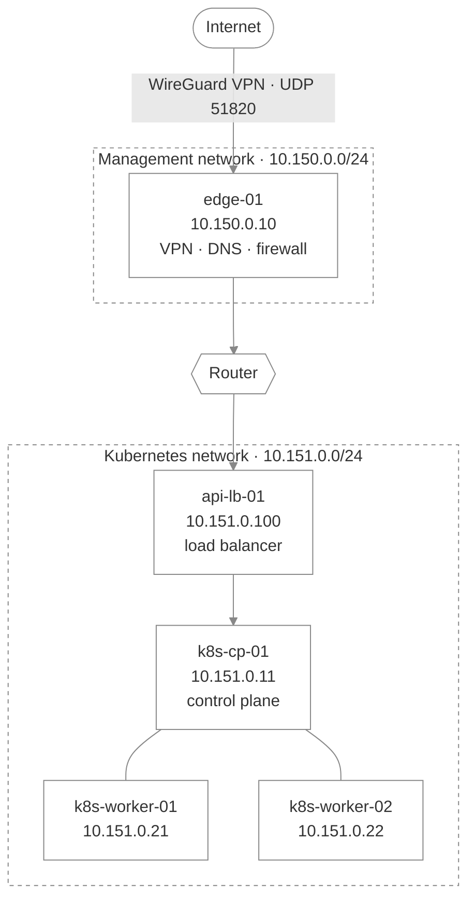

# Platform overview

## Machines

| Machine | IP | Size | Job |
| --- | --- | --- | --- |
| `edge-01` | `10.150.0.10` | 4 vCPU / 8 GB | Front door: VPN, DNS, firewall |
| `api-lb-01` | `10.151.0.100` | 2 vCPU / 4 GB | Load balancer for the Kubernetes API |
| `k8s-cp-01` | `10.151.0.11` | 4 vCPU / 8 GB | Kubernetes control plane |
| `k8s-worker-01` | `10.151.0.21` | 8 vCPU / 16 GB | Runs workloads |
| `k8s-worker-02` | `10.151.0.22` | 8 vCPU / 16 GB | Runs workloads |

## Networks

| Network | Range |
| --- | --- |
| Management | `10.150.0.0/24` |
| Kubernetes nodes | `10.151.0.0/24` |
| VPN | `10.152.0.0/24` |

## Firewall

Everything is blocked unless listed below. Rules are enforced twice: by OpenStack and on `edge-01`.

| Allowed | To | From |
| --- | --- | --- |
| WireGuard (UDP 51820) | `edge-01` | Anywhere |
| DNS (port 53) | `edge-01` | Our networks |
| SSH and ping | All machines | VPN users |